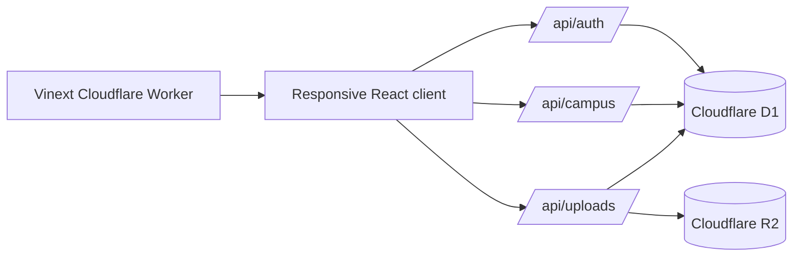

# CampusOne architecture



## Core entities

```mermaid
erDiagram
  USERS ||--o{ SESSIONS : owns
  USERS ||--o| USER_PROFILES : configures
  USERS ||--o{ RECORDS : creates
  USERS ||--o{ ACTIVITY : performs
  RECORDS ||--o{ UPLOADS : references
  USERS {
    integer id PK
    text email UK
    text password_hash
    text role
    integer verified
  }
  SESSIONS {
    text token PK
    integer user_id FK
    integer expires_at
  }
  USER_PROFILES {
    integer user_id PK_FK
    text department
    text skills
    text preferences
  }
  RECORDS {
    integer id PK
    text kind
    text title
    text status
    json meta
  }
  ACTIVITY {
    integer id PK
    text message
    text actor
    integer created_at
  }
  UPLOADS {
    text key PK
    text purpose
    integer owner_id FK
    integer size
  }
```

Campus entities use a typed-record model: `kind` distinguishes assignments, submissions, feedback, events, registrations, placements, applications, clubs, notifications, departments and courses. Structured relation metadata is stored as JSON while high-value cross-cutting data—users, profiles, sessions, activity logs and files—uses dedicated stores. All writes are same-origin checked and authorized from the server session.
